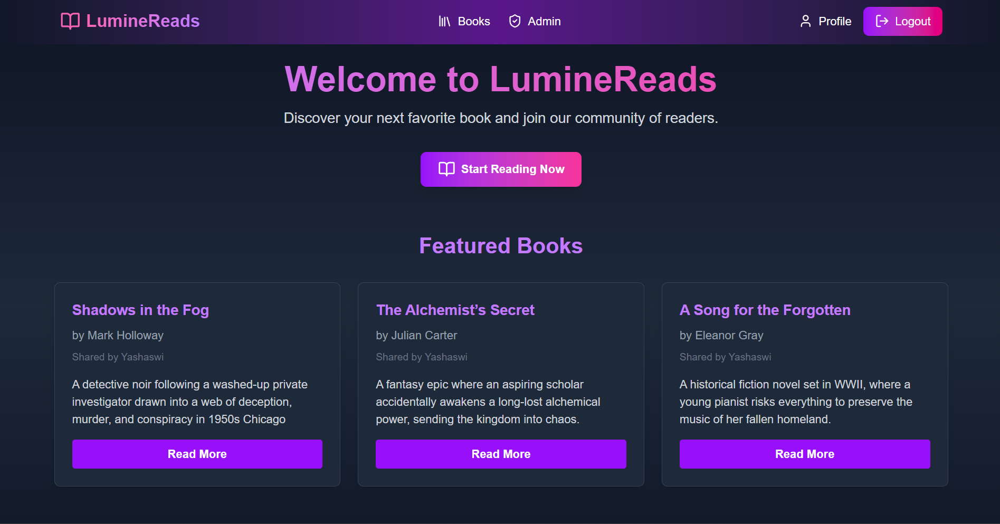
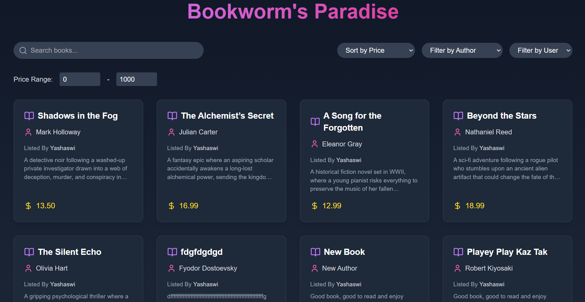
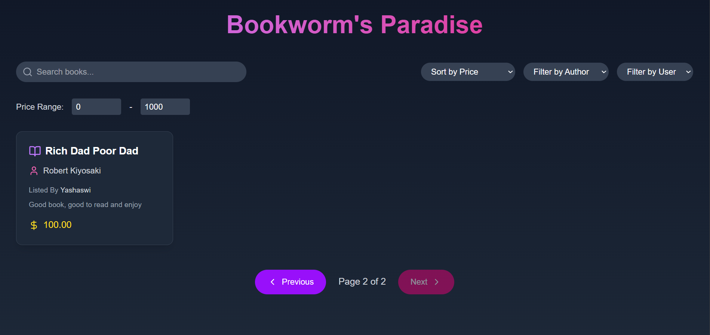
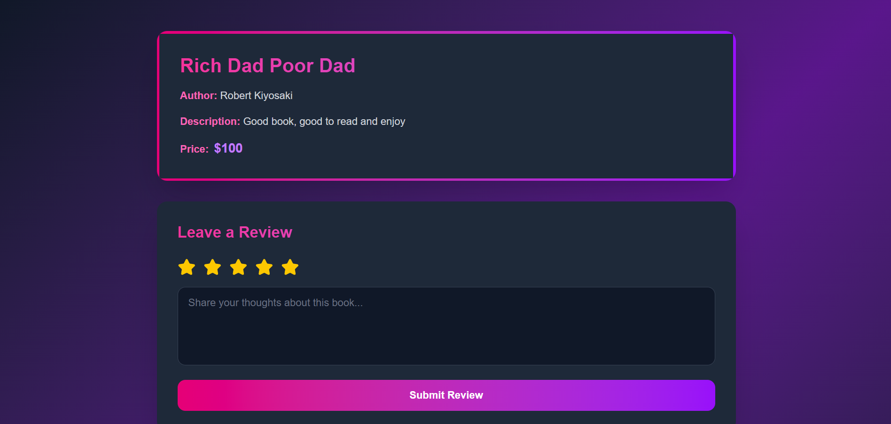
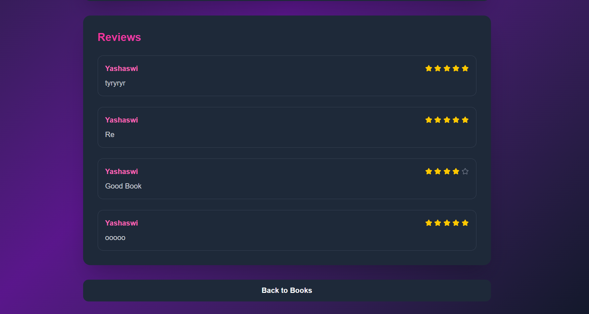
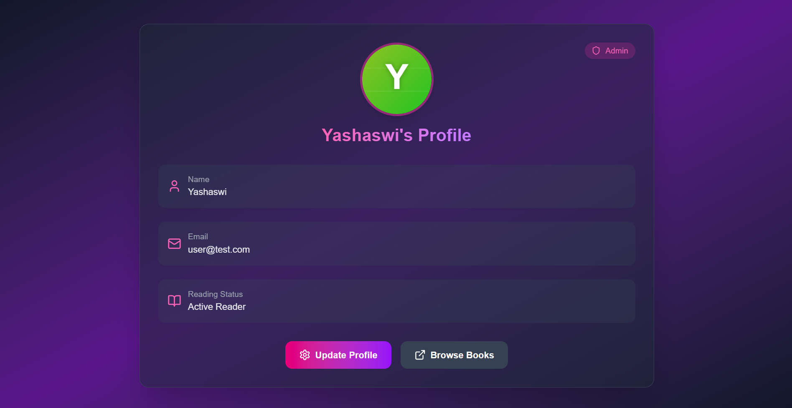
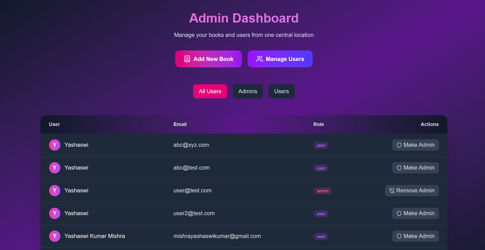

# Lumine Reads Client

Lumine Reads is a React + Vite + TypeScript-powered book marketplace featuring a curated selection of books, user reviews, and an admin panel for managing content. The client is built for seamless navigation and interaction with features like pagination, filtering, and real-time updates.

## Features

### User Features
- **Home Page**: Showcases featured books.
  
- **Books Listing Page**:
  - Browse books with pagination.
  - Apply filters for price range and author.
  - Perform custom searches with optimized results using `lodash.debounce`.
  
  
- **Book Review Page**:
  - View detailed book information.
  - Read and write reviews.
  
  
- **Profile Management**:
  - View personal profile.
  - Update user details.
  

### Admin Features
- **Book Management**:
  - Add new books.
  - Edit or delete existing books.
- **User Management**:
  - View registered users.
  - Switch user roles (e.g., Admin, Regular User).
  

## Tech Stack
- **React + Vite + TypeScript**
- **React Router** - For client-side navigation.
- **Axios** - For API requests.
- **React Query** - For efficient data fetching and caching.
- **Lodash.debounce** - For optimized search functionality.
- **React Hot Toast** - For displaying notifications.
- **Context API** - For global state management.
- **Tailwind CSS** - For styling.

## Installation

### Prerequisites
- Node.js & npm/yarn installed.

### Steps
1. Clone the repository:
   ```sh
   git clone https://github.com/your-username/lumine-reads-client.git
   cd lumine-reads-client
   ```
2. Install dependencies:
   ```sh
   npm install  # or yarn install
   ```
3. Start the development server:
   ```sh
   npm run dev  # or yarn dev
   ```

## Folder Structure
```
/ 
├── public               # Static files
├── src                  # Application source code
│   ├── assets           # Static assets
│   ├── context          # Global state management
│   ├── pages            # Application pages
│   ├── queries          # API query functions
│   ├── App.tsx          # Root component
│   ├── main.tsx         # Entry point
├── .gitignore           # Git ignore rules
├── index.html           # Main HTML file
├── package.json         # Project dependencies
├── tsconfig.json        # TypeScript configuration
├── vite.config.ts       # Vite configuration
```

## Usage
- Navigate to `/` to explore featured books.
- Visit `/books` for the full listing with filters and pagination.
- Click a book to view details and reviews at `/book/:id`.
- Admins can manage books and users at `/admin`.
- Users can update their profile at `/profile`.

## Contributing
Feel free to fork and contribute! Open an issue or create a pull request.

## License
MIT License

